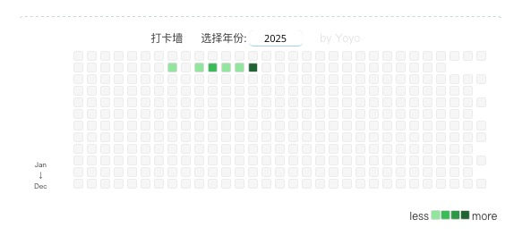

<a href="https://www.npmjs.com/package/hexo-everyday-calendar"></a>

# Instructions
1. Install it directly with npm
```bash
npm install hexo-everyday-calendar
```
2. Add it to plugins, the directory of which is the same level as source (a directory)
3. Make sure you have a div with classname 'site-body' in your theme. The calendar module will automatically be placed there
4. Custom place: In the place you want to put, set the classname of the div block to 'site-body', and you can put it in

# 使用说明
1. 直接用npm安装即可
```bash
npm install hexo-everyday-calendar
```
2. 同时放入与source同级的目录plugins下
3. 确保你的theme主题中有classname为'site-body'的div块，日历模块会自动放入这里
4. 自定义放入位置：在你想要放入的位置中，设置div块的classname为'site-body'，即可放入

# 更新 Update

- 2.14

1. 修复select居中情况
2. 增加打卡墙块根据提交数量形成颜色变化功能

- 2.21

1. 增加响应式布局，适配移动端
2. 修复select组件垂直不居中的问题
3. 国际化

# 图例 Example

